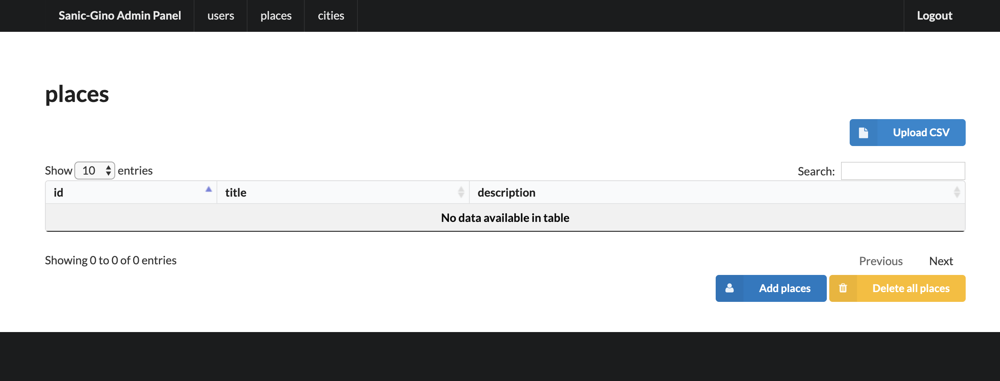

gino_admin
----------
Admin Panel for DB with Gino ORM and Sanic (inspired by Flask-Admin)

Work in progress

Supported operations
--------------------

- Simple auth
- Create item by one for the Model
- Delete all rows

In process:

- Upload rows from csv
- Delete item
- Edit item
- Select multiple for delete
- Edit multiple

Screens:
--------

.. image:: docs/img/auth.png
  :width: 250
  :alt: Simple auth

.. image:: docs/img/add_item.png
  :width: 250
  :alt: Add item

Contributions
---------------

Contributions and feature requests are very welcome!

