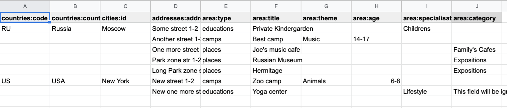

Upload CSV Files
================

Exist 2 supported formats of uploaded CSV files:

    - Upload table per model: one csv file contains data only for one table
    - Composite CSV files: when you define several relative tables in one file

Composite CSV to Upload
-----------------------
Default upload from CSV allows to load CSV with data per table.

Composite CSV files allow to load data for several tables from one CSV files and don't define ForeignKey columns.
You can define table from left to right and if previous table contain ForeignKey for the next table when as linked row will be taken value from current or previous row.
This allow you to define one time Country and 10 cities for it. If it sounds tricky - check example DB schema and XLS example on google docs.

This useful if you want to fill DB with related data, for example, User has some GiftCards (ForeignKey - user.id), GiftCard can be spend to pay off for some Order (ForeignKey - gift_card.id).
So you have set of data that knit together. If you works on some Demo or POC presentation - it's important to keep data consistent, so you want to define 'beautiful data', it's hard if you have 3-4-5 models to define in separate csv.

Composite CSV allow use CSV files with headers with pattern "table_name:column" and also allow to add aliases patterns

Check 'examples/composite_csv_example' code to check DB structure.

And XLS-table sample in Google Sheets: `table example`_

.. _table example: https://docs.google.com/spreadsheets/d/1ur63acwWExyjWouZ1WEkUxCX73vOcdXzCrEYc7cPhTg/edit?usp=sharing

Click - Download -> CSV and you will get result, that can be found in **examples/composite_csv_example/src/csv_to_upload**

Composite CSV can be loaded manual from any Model's Page where exist button 'Upload CSV' - it does not matter from that model you load.

Or you can define preset with Composite CSV and load it as preset. To use composite CSV you need to define key, that started with 'composite' word.

Example:

.. code-block:: python

    name: Composite CSV Preset
    description: "Init DB with data from composite CSV"
    files:
      composite_csv: csv/preset_a/users.csv

'composite_csv: csv/preset_a/users.csv' can be 'composite_any_key: csv/preset_a/users.csv'

You can use multiple composite CSV in one preset.

