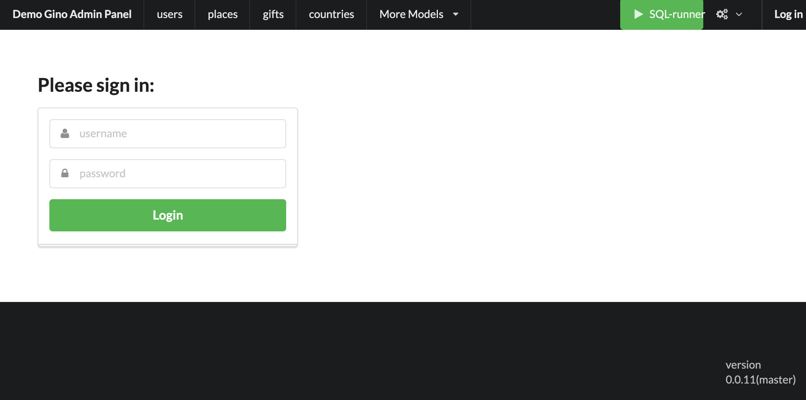

.. gino-admin documentation master file, created by
   sphinx-quickstart on Sat May 23 20:17:41 2020.
   You can adapt this file completely to your liking, but it should at least
   contain the root `toctree` directive.

Welcome to Gino-Admin's documentation!
======================================

Docs status: work in progress

Project's github: https://github.com/xnuinside/gino-admin

|badge1| |badge3| |badge2|

.. |badge1| image:: https://img.shields.io/pypi/v/gino_admin
.. |badge2| image:: https://img.shields.io/pypi/l/gino_admin
.. |badge3| image:: https://img.shields.io/pypi/pyversions/gino_admin

Play with Demo: `Gino-Admin demo`_

.. _Gino-Admin demo: http://xnu-in.space/gino_admin_demo

Installation
------------

.. code-block:: console

    $ pip install gino-admin==0.0.11

Admin Panel for PostgreSQL DB with Gino ORM and Sanic

.. image:: ../img/table_view_new.png
  :width: 500
  :alt: Table view

.. image:: ../img/db_presets.png
  :width: 500
  :alt: Load Presets

Quick start
-----------

Check in `Quick Start`_

.. _Quick Start: https://gino-admin.readthedocs.io/en/latest/quick_start.html

Version 0.0.11 Updates
----------------------

1. Added possibility to define custom route to Gino Admin Panel. With 'route=' config setting
By default, used '/admin' route

2. Added Demo Panel  `Gino-Admin demo`_ - you can log in and play with it. Login & pass - admin / 1234
If you don't see any data in UI maybe somebody before you cleaned it - go to Presets and load one of the data presets.

.. _Gino-Admin demo: http://xnu-in.space/gino_admin_demo

.. image:: https://github.com/xnuinside/gino_admin/blob/master/docs/img/logo/demo.png
  :width: 250
  :alt: Load Presets

3. Fixed minors issues: 1)floats now displayed with fixed number of symbols. Parameter can be changed with config param `round_number=`.
2) now file upload fill not raise error if no file was chosen

4. Deepcopy now ask id - you can use auto-generated or define own id to 'deepcopy object'

Full changelog for all versions see in [CHANGELOG.txt](CHANGELOG.txt)

.. toctree::
   :maxdepth: 2
   :caption: Contents:

   quick_start
   authorization
   cli
   examples
   config
   features
   rest_api
   presets
   csv_upload
   changelog
   ui_screens
   contributing

Indices and tables
==================

* :ref:`genindex`
* :ref:`modindex`
* :ref:`search`
