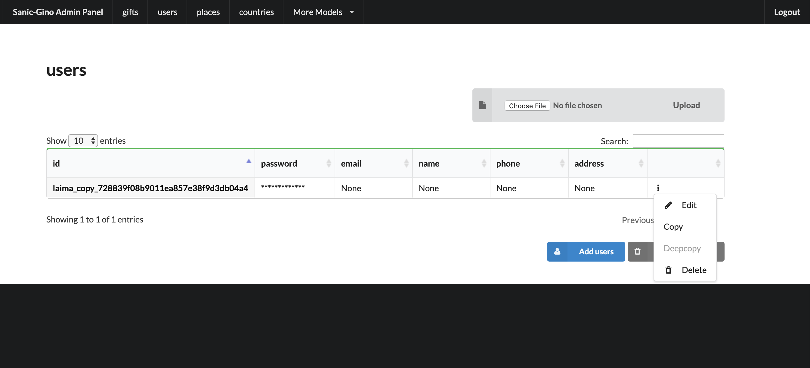
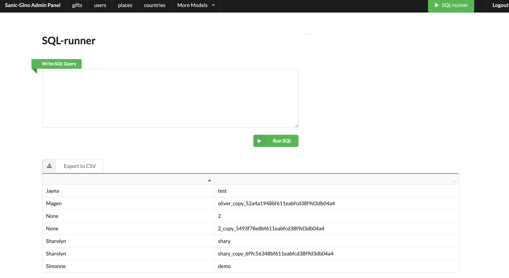
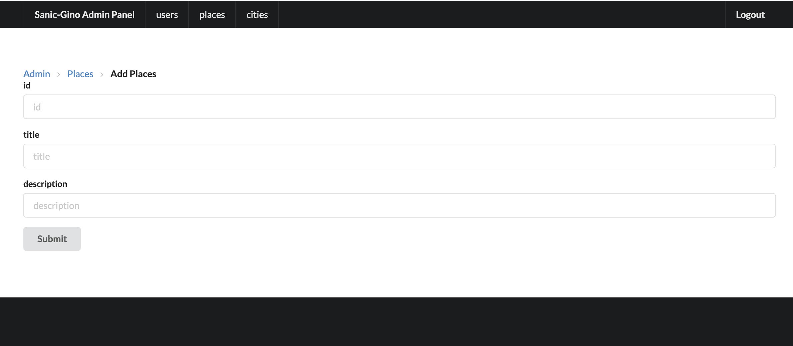
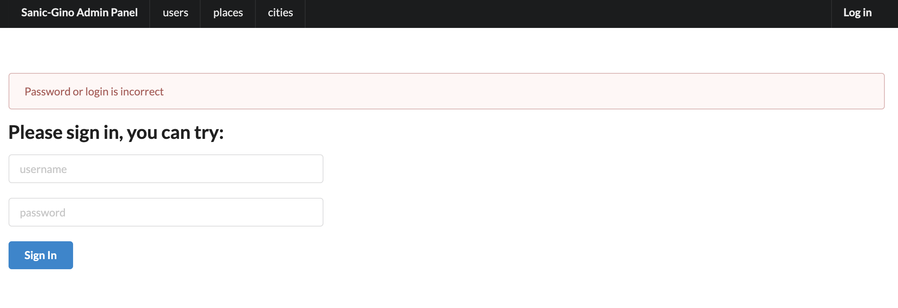
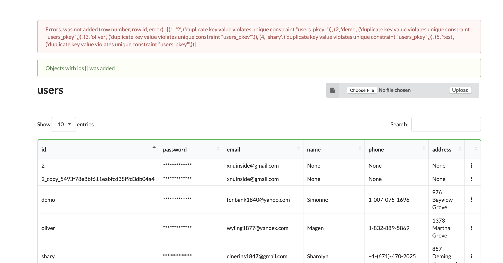

UI Screens
==========
New colors & possible change UI (since 0.2.1)
`````````````````````
.. image:: ../img/new_colors.png
  :alt: Table view

Table view
`````````````````````
.. image:: ../img/table_view_new.png
  :alt: Table view

Edit/delete/copy/deepcopy per item
``````````````````````````````````````````


SQL-runner
`````````````````````


Add item
`````````````````````


Authorisation
`````````````````````


Upload data from CSV
`````````````````````


Init DB (drop + recreate tables)
``````````````````````````````````````````
.. image:: ../img/db_clean_up.png
  :width: 250
  :alt: DB Drop